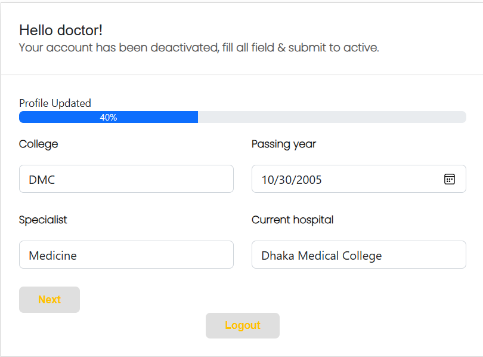
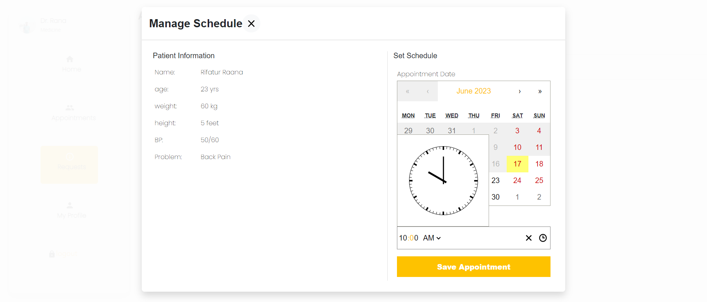
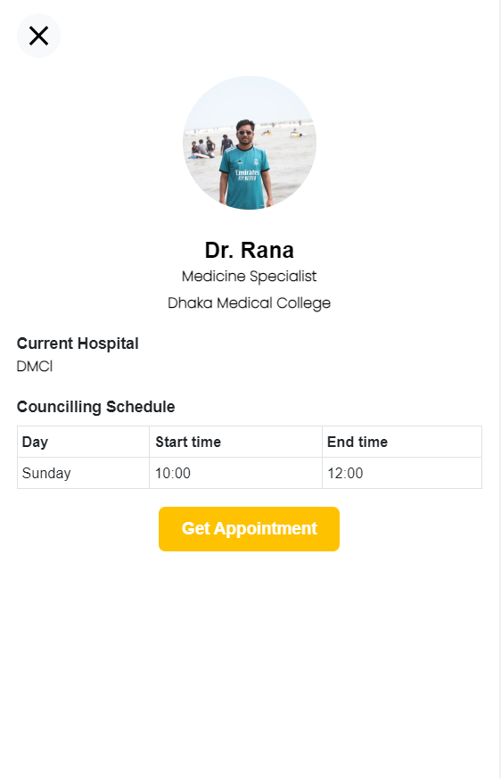
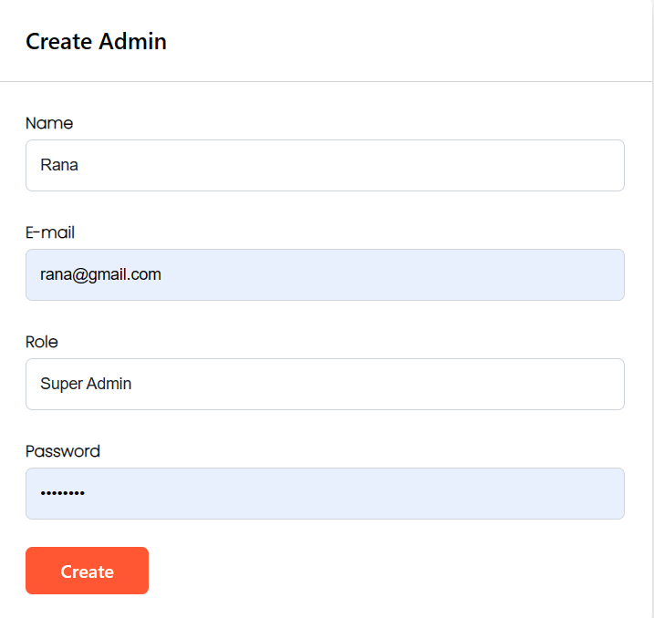

# DoctorsApp Web Application
DoctorsApp is a full-stack web application built using the MERN (MongoDB, Express.js, React.js, Node.js) stack. It provides a platform for patients, doctors, and admins to manage various aspects of medical appointments and user information. The application includes the following sections:
# Sections

## Doctor Section
Doctors can register and log in to the application, and their accounts require approval from admins. Doctors need to complete specific steps to fill out their profile completely before it can be approved. Once approved, doctors can manage their availability and appointment schedule. They can view and respond to appointment requests from patients and see their upcoming appointments. Doctors can also update their profile information.
Here are some screenshots for doctors:
<div align="center" >
      
   
    
   
  
   
  
    
     
  
   
</div>
## Patient Section
Patients can register and log in to the application using their credentials. They have access to a search option to find doctors based on specific criteria. Patients can request appointments with doctors, which will be sent to the doctor's request appointment section. Patients can view and manage their appointments through their dashboard. Additionally, patients can update their profile information. 
Here are some screenshots for patients:
<div >
            
   
      
       
      
        
     
    
   
  

</div>


## Admin Section
Admins have the authority to approve or reject doctor accounts. They can create different roles such as super_admin or manager. Admins have access to statistics such as the total number of patients, doctors, and appointments within the application.
Here are some screenshots for Admins:
<div align="center">
    
     
    
    
   
  
</div>

# Features
## Progressive Web App (PWA)
The application functions as a PWA, allowing users to install it and receive installation notifications. In offline mode, a single page is shown, informing users to go online to book an appointment.
<div align="center">
    
     
</div>

## Loader, Toast, and 404 Pages
The application includes beautifully designed loaders and toast notifications to enhance the user experience. Additionally, a customized 404 page is implemented for handling invalid routes
<div align="center">
    
     
      
     
</div>

# Technologies Used
The application is developed using the following technologies and frameworks:
Frontend: React.js, HTML, CSS, JavaScript
Backend: Node.js, Express.js
Database: MongoDB
Authentication: JWT (JSON Web Tokens)
Styling: CSS frameworks (e.g., Bootstrap, Material-UI)
Data Fetching: Axios
State Management: React Context API, Redux (optional)
Deployment
The DoctorsApp web application is deployed using the following services:

Frontend: Netlify (https://www.netlify.com/)
Backend: Heroku (https://www.heroku.com/)
Database: MongoDB Atlas (https://www.mongodb.com/cloud/atlas)

`[https://bookdoctoronline.herokuapp.com/ ] Please note that the Heroku deployment has a time limit, which may result in the temporary unavailability of the application.`

# Prerequisites
Before running the DoctorsApp web application, ensure that you have the following prerequisites installed:
Node.js (version 12 or above)
MongoDB (locally or a remote instance)
Package Manager (npm or yarn)
Installation and Setup
Clone the repository or download the source code.
Navigate to the project directory in your terminal.
Install the required dependencies by running the following command:
```
npm install
```
Configure the backend connection to your MongoDB database. Update the MongoDB connection URI in the configuration files.
Start the backend server by running the following command:
```
npm run server
```
Open a new terminal window and navigate to the project directory.
Change to the client directory by running the following command:
```
cd client
```
Install the frontend dependencies by running the following command:
```
npm install
```
Start the frontend development server by running the following command:
```
npm start
```
Access the application by opening your browser and visiting http://localhost:3000.

# Contributions

Contributions to the DoctorsApp web application are welcome. If you encounter any issues or have suggestions for improvements, please open an issue on the project's GitHub repository.

# License
The DoctorsApp web application is released under the MIT License.

# Acknowledgments
The development of the DoctorsApp web application was made possible thanks to the contributions and support of the open-source community.
